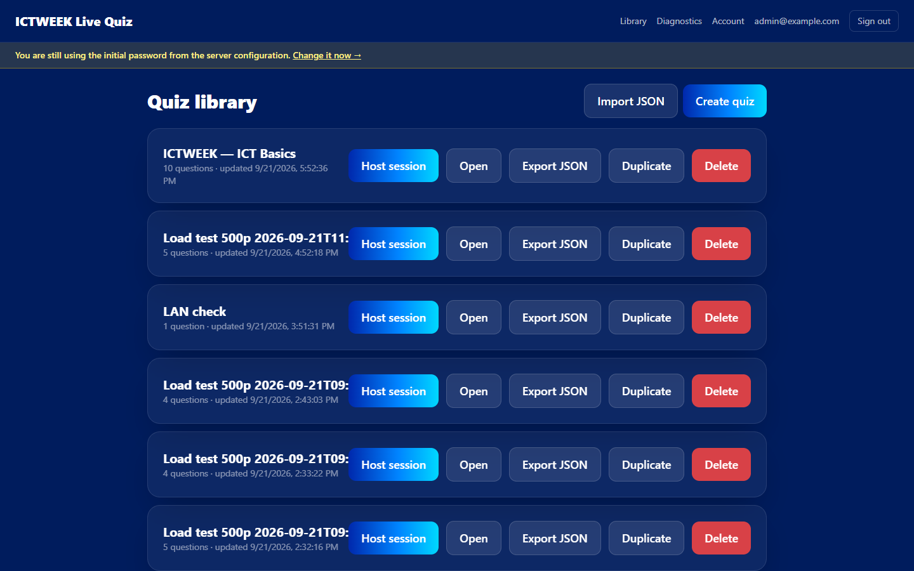
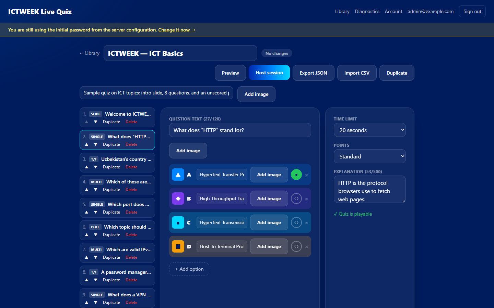
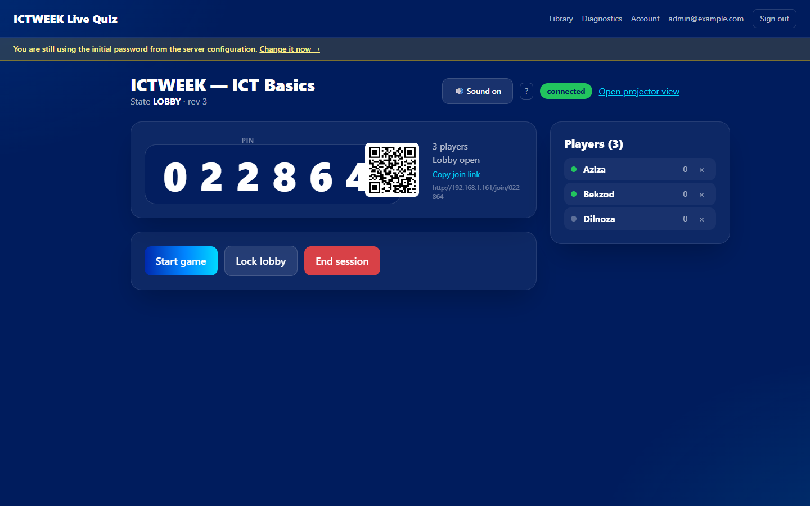
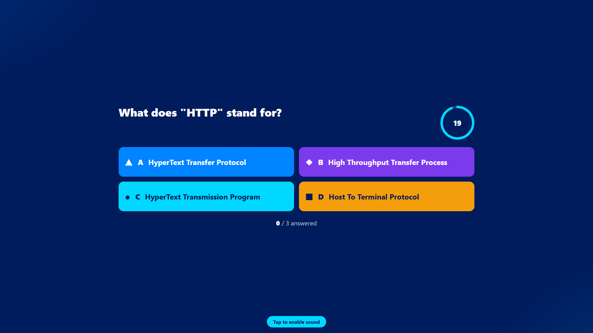
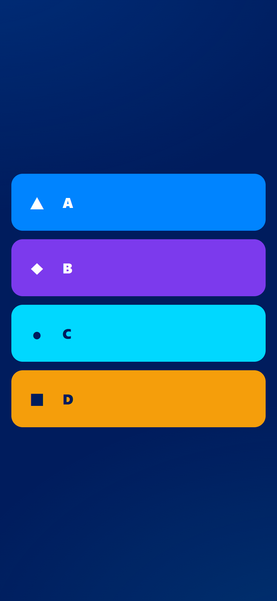

# ICTWEEK Live Quiz

ICTWEEK Live Quiz is a self-hosted live quiz application for events. An
organizer authors quizzes in a web editor, hosts a game session, and the
audience joins from their phones with a 6-digit PIN or a QR code — no accounts,
no app install. A projector view shows the lobby, questions, answer
distribution, leaderboards and the podium; the host controls the pace from any
device. After the game, per-question and per-player reports export to CSV.
Everything runs on your own server: Node.js + PostgreSQL + Docker Compose.

| Quiz library | Question editor | Host lobby |
| --- | --- | --- |
|  |  |  |

| Projector (1920×1080) | Phone (390×844) |
| --- | --- |
|  |  |

## Table of contents

- [Quick start (local, 5 minutes)](#quick-start-local-5-minutes)
- [Production install on Ubuntu (Docker Compose)](#production-install-on-ubuntu-docker-compose)
- [Organizer guide — creating a quiz](#organizer-guide--creating-a-quiz)
- [Importing questions](#importing-questions)
- [Hosting a game](#hosting-a-game)
- [Projector view](#projector-view)
- [Keyboard shortcuts](#keyboard-shortcuts)
- [What players see](#what-players-see)
- [If something goes wrong during the game](#if-something-goes-wrong-during-the-game)
- [Reports](#reports)
- [Scoring](#scoring)
- [Operations](#operations)
- [Development](#development)
- [Known limitations and open items](#known-limitations-and-open-items)
- [Documentation index](#documentation-index)

## Quick start (local, 5 minutes)

Requirements: Node.js ≥ 22, pnpm 11 (`corepack enable` then
`corepack prepare pnpm@11.22.0 --activate`), Docker Desktop/Engine (for the dev
Postgres only — the app itself needs no Docker in development).

```bash
git clone <this-repo> ictquiz
cd ictquiz
cp .env.example .env          # optional edits: INITIAL_ORGANIZER_EMAIL /
                              # INITIAL_ORGANIZER_PASSWORD set your first login
pnpm install --frozen-lockfile
pnpm db:up                    # Postgres 16 on :5432 (docker/compose.dev.yml)
pnpm db:migrate               # apply schema migrations
pnpm dev                      # API on :3000 + web dev server on :5173
```

Open <http://localhost:5173/admin>, sign in with the bootstrap organizer
(default `.env`: `admin@example.com` / `ChangeMe123!`), then **change the
password on the Account page** (header → Account). A yellow banner reminds you
while the bootstrap password is still in use.

The dev API is on <http://localhost:3000>. Extra organizers:
`pnpm --filter @ictquiz/server create-organizer -- <email> <password>`.

To try the join flow with real phones on your Wi-Fi (no domain needed), follow
[`docs/runbooks/lan-rehearsal.md`](docs/runbooks/lan-rehearsal.md).

## Production install on Ubuntu (Docker Compose)

The stack is three services: `db` (PostgreSQL 16, unpublished), `app`
(multi-stage build; the entrypoint runs `prisma migrate deploy` then starts),
and `caddy` (automatic HTTPS + WebSocket proxy). Everything builds inside
Docker — the server needs no Node.js.

```bash
# on the server (Ubuntu 22.04/24.04, Docker Engine + compose plugin installed)
git clone <this-repo> /opt/ictquiz && cd /opt/ictquiz
git checkout <release-tag>
cp docker/.env.example docker/.env
nano docker/.env                 # DOMAIN, PUBLIC_URL, POSTGRES_PASSWORD,
                                 # SESSION_SECRET, INITIAL_ORGANIZER_*
sed -i "s/^#\?APP_TAG=.*/APP_TAG=$(git rev-parse --short HEAD)/" docker/.env
docker compose -f docker/compose.yml --env-file docker/.env up -d --build
docker compose -f docker/compose.yml --env-file docker/.env ps   # app (healthy), db (healthy), caddy Up
curl -fsS https://<DOMAIN>/api/health                            # {"ok":true,"db":{"ok":true}}
```

Then open `https://<DOMAIN>/admin`, log in with `INITIAL_ORGANIZER_*`, and
**change the password** (Account page, or
`docker compose -f docker/compose.yml --env-file docker/.env exec -w /app/apps/server app node dist/scripts/set-password.js <email> '<password>'`).
Only after that, remove `INITIAL_ORGANIZER_EMAIL`/`INITIAL_ORGANIZER_PASSWORD`
from `docker/.env` and `up -d` again — removing them first does not change the
existing account's password.

HTTPS requires a public domain with a DNS A record and ports 80/443 open —
Caddy obtains the certificate automatically. For a room without a domain or
public DNS, use the LAN runbook instead:
[`docs/runbooks/lan-rehearsal.md`](docs/runbooks/lan-rehearsal.md). Full deploy
instructions: [`docs/runbooks/deploy.md`](docs/runbooks/deploy.md); the
one-page checklist for whoever owns the server:
[`docs/DEPLOYMENT_HANDOFF.md`](docs/DEPLOYMENT_HANDOFF.md).

## Organizer guide — creating a quiz

Sign in at `/admin` → the **Quiz library** page lists your quizzes. From here
you can **Create quiz**, **Import JSON**, and per quiz: open it (title or
**Open**), **Host session**, **Export JSON**, **Duplicate**, **Delete**
(asks to confirm). Below the cards, **Recent sessions** lists past and live
games with **Open host** / report links.

The **editor** has three columns:

- **Left — question list.** Each row shows its number, a type badge
  (`SLIDE`, `SINGLE`, `T/F`, `MULTI`, `POLL`) and the text. Reorder with
  **▲ / ▼**, **Duplicate**, **Delete**. Below the list, the add-question menu:
  **+ Single choice**, **+ True / False**, **+ Multi-select**, **+ Poll**,
  **+ Content slide**.
- **Centre — the selected question.** Question text, option fields
  (`Option A`, `Option B`, …), the correct-answer toggle (radio dot for single
  choice, per-option checkboxes for multi-select — hover title "Mark correct"),
  **×** to delete an option, **+ Add option** (max 6), **Add image** per
  question and per option.
- **Right — settings.** **Time limit** (5 / 10 / 20 / 30 / 60 / 90 / 120 /
  240 seconds), **Points** (Standard / Double / None — hidden on polls),
  **Explanation** (≤ 500 characters, shown after the reveal), and a **Play
  issues** list or **✓ Quiz is playable**.

Question types:

| Type | Behaviour |
| --- | --- |
| **Single choice** | 2–6 options, exactly one correct. Players tap once. |
| **True / False** | Fixed True/False options, exactly one correct. |
| **Multi-select** | 2–6 options, one or more correct. Players select several then press **Submit**. Scoring awards per correct option selected and zero if any wrong option is picked — full rules in [`docs/SCORING.md`](docs/SCORING.md). |
| **Poll** | Unscored — no correct answer, no points, no streak change, and **no leaderboard afterwards**. Players tap once, see "Vote sent". |
| **Content slide** | Title + body text + optional image. Not scored, not timed — the host advances it with Next. |

Limits: quiz title 1–95 chars; description ≤ 500; question text 1–120
(required on everything except a content slide's title, which is still
required); option text 1–75; 2–6 options (single/multi) — true/false and polls
are fixed; explanation ≤ 500. Images: PNG/JPEG/WebP/GIF up to 5 MB
(`MAX_UPLOAD_MB`), magic-byte validated server-side; every image has an
alt-text field.

Edits **autosave** (800 ms debounce) — watch the pill in the toolbar:
`No changes` → `Saving…` → `Saved` or `Save failed — retry`. The header also
has **Preview** (a simulated run-through where nothing is saved), **Host
session**, **Export JSON**, **Import CSV**, **Duplicate**, **Delete**. A quiz
can carry an optional **cover image** shown on the library card and in the
lobby.

## Importing questions

### CSV (per quiz, in the editor)

Editor toolbar → **Import CSV** → **Choose CSV file** → a preview lists the
parsed questions and every row-level error → **Import N questions** appends
the valid rows. **Download the template** from the same dialog (or
[`docs/samples/import-template.csv`](docs/samples/import-template.csv)).
Columns, in order:

`type,question,option1,option2,option3,option4,option5,option6,correct,timeLimit,points,explanation`

| Column | Values |
| --- | --- |
| `type` | `single`, `truefalse`, `multi`, `poll`, `content` |
| `question` | Question text (or slide title for `content`) |
| `option1`–`option6` | Option texts; leave unused cells empty. Ignored for `truefalse` (fixed True/False) and `content`. |
| `correct` | 1-based option indexes separated by `;` (e.g. `1` or `1;3`). `single`/`truefalse` need exactly one; `multi` needs at least one; leave **empty** for `poll` and `content`. |
| `timeLimit` | One of 5, 10, 20, 30, 60, 90, 120, 240. Empty for `content`. |
| `points` | `standard`, `double`, `none`. Empty/`none` for `poll`/`content`. |
| `explanation` | Optional; also the body text of a `content` slide. |

Imported CSV text is treated as plain text. Exported report CSVs escape cells
that start with `=`, `+`, `-`, `@` so spreadsheets never execute them.

### JSON (whole quiz, in the library)

**Import JSON** on the library page expects an `ictquiz-v1` export:

```json
{
  "format": "ictquiz-v1",
  "quiz": {
    "title": "My quiz",
    "description": "optional",
    "questions": [
      {
        "type": "SINGLE",
        "text": "What does HTTP stand for?",
        "timeLimitSec": 20,
        "pointsMode": "STANDARD",
        "explanation": "optional",
        "options": [
          { "text": "HyperText Transfer Protocol", "isCorrect": true },
          { "text": "Host To Terminal Protocol", "isCorrect": false }
        ]
      }
    ]
  }
}
```

`type` is `SINGLE | TRUE_FALSE | MULTI | POLL | CONTENT`. A ready-made file:
[`docs/samples/sample-quiz.json`](docs/samples/sample-quiz.json) (intro slide,
8 questions, 1 poll). **Export JSON** on a quiz produces the same shape —
use it to move quizzes between installs or to back them up.

## Hosting a game

1. Library → **Host session** on a quiz (or the editor's **Host session**
   button) → the settings page.
2. Review the settings:
   - **Max participants** — hard cap on joins (default 500, max 2000).
   - **Show question text on phones** — off: phones show only the
     shape/letter/colour cards and players must watch the projector; on:
     phones also show the question and option text (needed if there is no
     projector).
   - **Randomize question order** — shuffle questions per session; content
     slides keep their authored position.
   - **Randomize answer order** — shuffle options per session.
   - **Allow late join** — on: phones can join mid-game and start answering
     at the next question; off: the lobby locks when the game starts.
3. **Start session** creates the session and opens the **host page** (this
   opens a lobby — the game does not start yet). The host page shows the
   **PIN**, a **QR code**, the join URL with **Copy join link**, **Open
   projector view**, the player count and lobby state, and the **Players**
   list (each row has **×** to remove — asks "Remove <name>?" first).
4. Players join (see below). **Lock lobby** stops new joins without starting.
5. **Start game** → a 5-second countdown, then the question opens. The host
   panel shows the question, the timer ring and `answered / eligible`.
   Answers close automatically when every eligible player has answered or the
   timer runs out — or press **Close answers** early.
6. **Answer reveal** → distribution with the correct option marked ✓ →
   **Next** → **Leaderboard** (top 5 with ▲/▼ movement) → **Next** → next
   question. After a poll there is no leaderboard; after a content slide,
   **Next** goes straight on.
7. After the last question, **Show podium** → the top 3 on host and
   projector; phones show each player's final rank. **Open report →** opens
   the session report.
8. **End session** (red button, always available) asks "End this session for
   everyone?" — ending mid-question **voids** that question's answers; they
   are excluded from the report.

Tell the audience: **"Go to the URL on screen — or scan the QR — enter the
PIN, and pick a nickname."** No account, no install.

## Projector view

**Open projector view** on the host page opens `/display/<key>` in a new
window. The link contains a secret key — anyone with it can open a projector
view, so do not post it publicly. No login is needed; a second machine can
drive the projector while the host uses a laptop.

- Press **F** or your OS fullscreen shortcut for fullscreen; click the page
  once if the **Tap to enable sound** pill is showing (browser autoplay rules
  require one interaction before cues can play).
- It shows, in order: lobby (PIN, QR, join URL, player names as they join),
  "Get ready…" countdown ring, the question with the answer cards and a
  live answered counter, the reveal with the per-option distribution bars and
  the correct option highlighted, the top-5 leaderboard, and the podium.
- If the server restarts mid-question it shows "The host is resuming the
  game…" until the host picks Replay question or End session.

## Keyboard shortcuts

Host page (press **?** to see this list in-app):

| Key | Action |
| --- | --- |
| `Space`, `→`, `N` | Primary action: Start game / Next / Replay question |
| `C` | Close answers (during a question) |
| `L` | Lock / unlock lobby |
| `F` | Fullscreen |
| `M` | Sound on / off (host page and projector) |
| `?` | Toggle the shortcuts panel |

## What players see

- Open the join URL (or `/` → **Game PIN** → **Join game**); a wrong PIN shows
  "Game not found — check the PIN".
- Pick a nickname (max 20 chars); a taken one shows "That nickname is taken —
  try another one." → **Enter lobby** → "You're in! See your name on the big
  screen."
- Each question: a 5-second "Get ready…" countdown, then the answer cards —
  shape + letter + colour, plus option text and the question text only if the
  host enabled "Show question text on phones". One tap answers single choice /
  true-false / poll; multi-select needs several taps then **Submit**.
- "Answer sent" / "Vote sent" confirms the tap; the reveal shows "Correct!"
  with +points (and streak ×N), "Incorrect", or "Thanks for voting!" on a
  poll, plus the question's explanation if one was set.
- The leaderboard shows "You're #N" with your score; the podium shows "Thanks
  for playing" with your final rank and the top 3.
- Joining mid-question shows "Hold tight — you'll join at the next question."
- Refreshing or losing Wi-Fi keeps the seat: the game resumes from the stored
  token, and a yellow "Reconnecting…" pill shows while the connection is down.
- A removed player is signed out of the game. (Known issue: they currently see
  a blank page instead of the removal notice — H1 in
  [Known limitations](#known-limitations-and-open-items).)

## If something goes wrong during the game

- **Host laptop dies** — the current question still finishes on its server
  timer and players see the reveal. Open `/admin/host/<session-id>` on any
  other device and take over; nothing auto-advances, so the room waits for
  you.
- **Server restarted / crashed** — mid-question the game comes back in
  **RECOVERY**: the host page shows "Interrupted — replay or end" with
  **Replay question** (voids the interrupted attempt, scores stay clean) or
  **End session**. Lobbies and stable states resume as they were.
- **A phone loses Wi-Fi** — nothing to do: the player reconnects
  automatically with the same nickname and score.
- **Wrong/offensive nickname** — remove the player (**×** in the Players
  list); they cannot rejoin under the same name in that session.
- **Players cannot join** — check: the PIN on the projector, **Lobby
  locked** (unlock it), **Max participants** reached, the room's firewall
  (players must reach the server URL), or a burst of wrong-PIN attempts
  tripping the per-IP join limiter (wait a minute; limits in
  [Operations](#operations)).
- Full incident table and event-day checklist:
  [`docs/runbooks/event-day.md`](docs/runbooks/event-day.md).

## Reports

Every session keeps a report at `/admin/sessions/<id>/report` (also reachable
from the finished game via **Open report →** and from the library's **Recent
sessions** → report link):

- Header: quiz title, PIN, date, player count, slide/scored-question counts,
  final state.
- **Standings** — final rank, score, correct count, answered count, average
  answer time per player.
- Per-question panels — the options with their answer-count bars and the
  correct option marked.
- **Responses** — every stored answer row, filterable by participant.
- **Download CSV** — the same data as CSV, formula-injection safe.

Voided attempts (a question open when the session ended or was replayed after
a restart) and removed players are excluded.

## Scoring

Standard questions are worth up to 1000 points, Double up to 2000, "No points"
0; answering in under 500 ms earns full points, then the score decays linearly
to a 50 % floor at the time limit. Multi-select pays 500 (1000 on Double) per
correct option picked, but any wrong pick scores 0 and breaks the streak.
Streaks are displayed but award no bonus points. Ties are broken
deterministically: more correct answers, then faster total response time, then
earlier join. Polls and content slides are never scored. Full rules, worked
examples and tie-break order: [`docs/SCORING.md`](docs/SCORING.md).

## Operations

### Environment variables

`docker/.env` (created from `docker/.env.example`, never committed):

| Variable | Purpose |
| --- | --- |
| `DOMAIN` | Public hostname Caddy serves TLS for (needs a DNS A record) |
| `PUBLIC_URL` | `https://<DOMAIN>` — join links, QR codes, CSRF origin check, secure cookies |
| `POSTGRES_PASSWORD` | Database password (db is not published outside the stack) |
| `DATABASE_URL` | App DB connection — set by compose from the password; kept for reference |
| `SESSION_SECRET` | Reserved server secret — `openssl rand -hex 32` |
| `MEDIA_DIR` | Upload dir inside the container (`/data/media`, named volume) |
| `INITIAL_ORGANIZER_EMAIL` / `INITIAL_ORGANIZER_PASSWORD` | First organizer, created only while the table is empty — remove after first login |
| `MAX_UPLOAD_MB` | Image upload limit (default 5) |
| `TRUST_PROXY` | `1` behind the bundled Caddy so rate limits see real client IPs |
| `APP_TAG` | Deployed image tag — the rollback mechanism; edit this file, never `export` |

Optional server tuning (defaults in `apps/server/src/env.ts`):

| Variable | Default | Purpose |
| --- | --- | --- |
| `COUNTDOWN_MS` | `5000` | Pre-question countdown length |
| `JOIN_FAIL_PER_MIN` / `JOIN_FAIL_PER_HOUR` | `120` / `1000` | Per-IP failed join/PIN lookups before limiting (shared by HTTP + sockets) |
| `JOIN_SUCCESS_PER_MIN` | `1200` | Per-IP successful joins per minute (venue-NAT safe) |
| `PORT` | `3000` | App listen port |

The dev `.env` (from `.env.example`) uses `DATABASE_URL`,
`DATABASE_URL_TEST`, `SESSION_SECRET`, `PUBLIC_URL`, `MEDIA_DIR`, `PORT`,
`INITIAL_ORGANIZER_*`.

### Backup / verify / restore

- `docker/backup.sh` → `docker/backups/<ts>/` with `db.dump` + `media.tar`.
- `docker/verify-backup.sh <dir>` — restores into a **throwaway** Postgres
  container, prints row counts and cross-checks media files; live data is
  never touched. Run it after every backup.
- `docker/restore.sh --yes <dir>` — **destructive**: replaces the live
  database and media volume; refuses without `--yes`.

Runbook: [`docs/runbooks/backup-restore.md`](docs/runbooks/backup-restore.md).

### Rollback

Set `APP_TAG` in `docker/.env` to the previous image tag and
`up -d --no-build`; keep the last two `ictquiz-app:<sha>` tags and never run
`docker image prune -a` on the event host. Rehearse the whole cycle against
the real compose file without touching the live stack:
`docker/rollback-rehearsal.sh <old-sha>`. Migration-compatibility rules and
when a DB restore is required:
[`docs/runbooks/rollback.md`](docs/runbooks/rollback.md).

### Load test / diagnostics / HTTPS

- Load-test harness (drives real Socket.IO clients through a full game):
  `pnpm --filter @ictquiz/server load-test -- --players 500 --questions 5
  --time-limit 10 --burst-ms 2000 --url https://<DOMAIN> --origin https://<DOMAIN>
  --email <organizer> --password '<pw>'` — measured results in
  [`docs/TEST_REPORT.md`](docs/TEST_REPORT.md), server runbook in
  [`docs/runbooks/server-load-test.md`](docs/runbooks/server-load-test.md).
- **Diagnostics** page (`/admin/diagnostics`, organizer login): uptime, memory,
  DB latency, socket/room counts, recent errors.
- HTTPS is handled by Caddy (automatic certificates, HSTS, http→https
  redirect); see [`docs/runbooks/deploy.md`](docs/runbooks/deploy.md).

## Development

Monorepo:

```
packages/shared    rules, scoring, ranking, quiz validation, CSV, socket contract
apps/server        Fastify + Socket.IO + Prisma/PostgreSQL, game engine, docker scripts
apps/web           React + React Router + TanStack Query, utility-class styling
apps/e2e           Playwright suite (production build, real Chromium)
docker/            compose.yml, Dockerfile, Caddyfile, backup/restore/verify/rollback scripts
docs/              runbooks, samples, audit, parity matrix, test report
```

Root scripts:

```bash
pnpm dev            # API :3000 + vite dev server :5173 (proxied)
pnpm lint           # eslint across the workspace
pnpm typecheck      # tsc --noEmit per package
pnpm test           # vitest per package (server tests need the dev Postgres)
pnpm build          # shared → server (prisma generate + tsc) → web (vite)
pnpm e2e            # build + Playwright: 10-check suite on the production build (:3100)
pnpm format         # prettier --write
pnpm db:up          # dev Postgres on :5432
pnpm db:migrate     # prisma migrate deploy against DATABASE_URL
```

Tests: `packages/shared` is pure unit tests; `apps/server` is integration
tests against the dev Postgres (`ictquiz_test`, created by the compose init
script); `apps/e2e` drives a real browser through the full journey against the
built app. The load-test harness is `apps/server/scripts/load-test.ts`; the
`shot-*.mjs` scripts capture screenshots via headless Chrome/CDP and are
Windows-dev-only (hardcoded Chrome path — adjust `CHROME` constant).

Conventions: TypeScript strict everywhere, ESLint + Prettier (`pnpm format`
before committing), schema changes via Prisma migrations in
`apps/server/prisma/migrations`, no build-time secrets. The authoritative spec
is [`docs/DESIGN.md`](docs/DESIGN.md).

## Known limitations and open items

- Capacity is **verified on the development machine only** (500 players pass;
  see [`docs/TEST_REPORT.md`](docs/TEST_REPORT.md) §2A) — the event-server
  tier runs in §2B are still pending real hardware.
- Accepted behavioural differences vs. the reference product are catalogued in
  [`docs/AUDIT.md`](docs/AUDIT.md) §B (16 items, e.g. single-select polls only,
  no lobby music, no auto-advance, fixed 5 s countdown).
- Open usability findings ([`docs/USABILITY_REVIEW.md`](docs/USABILITY_REVIEW.md) §1):
  - **H1** — a removed player's phone shows a blank page instead of the
    removal notice.
  - **H2** — at 1280×720 the host's primary control can sit below the fold.
  - **H3** — phones show no time remaining or question number during a
    question; a poll looks identical to a scored question.
  - **H4** — the "Q n/m" counter counts content slides.
  - **H5** — the session-create button reads "Start session" although it only
    opens the lobby.

## Documentation index

| File | Purpose |
| --- | --- |
| [`docs/DESIGN.md`](docs/DESIGN.md) | Architecture and protocol spec — the authoritative design document |
| [`docs/DEPLOYMENT_HANDOFF.md`](docs/DEPLOYMENT_HANDOFF.md) | One-page checklist for the person deploying to the event server |
| [`docs/AUDIT.md`](docs/AUDIT.md) | Implementation vs. plan audit — fixed gaps, accepted differences, pending hardware checks |
| [`docs/PARITY_MATRIX.md`](docs/PARITY_MATRIX.md) | Behaviour-by-behaviour comparison with the reference product |
| [`docs/SCORING.md`](docs/SCORING.md) | Exact scoring, multi-select partial credit, streak and tie-break rules |
| [`docs/TEST_REPORT.md`](docs/TEST_REPORT.md) | What was tested, when, and the measured numbers (incl. load tests and the rollback rehearsal) |
| [`docs/USABILITY_REVIEW.md`](docs/USABILITY_REVIEW.md) | Hands-on review findings (H1–H5, medium, cosmetic) |
| [`docs/runbooks/deploy.md`](docs/runbooks/deploy.md) | Full Ubuntu + Docker install, DNS/TLS, first login |
| [`docs/runbooks/lan-rehearsal.md`](docs/runbooks/lan-rehearsal.md) | Run the stack on a LAN IP for venue/phone testing without a domain |
| [`docs/runbooks/event-day.md`](docs/runbooks/event-day.md) | Event-day timeline, checklist, incident table |
| [`docs/runbooks/backup-restore.md`](docs/runbooks/backup-restore.md) | Backup schedule, isolated verification, restore procedure |
| [`docs/runbooks/rollback.md`](docs/runbooks/rollback.md) | Image rollback, migration compatibility, rehearsal script |
| [`docs/runbooks/server-load-test.md`](docs/runbooks/server-load-test.md) | Exact load-test commands for the target server |
| [`docs/samples/sample-quiz.json`](docs/samples/sample-quiz.json) | Ready-to-import demo quiz (slide + questions + poll) |
| [`docs/samples/import-template.csv`](docs/samples/import-template.csv) | CSV import template with one row per type |
| [`docs/plan/README.md`](docs/plan/README.md) | Original project plan (kept for reference) |
| [`docs/plan/BUILD_PROMPT.md`](docs/plan/BUILD_PROMPT.md) | Original build specification (kept for reference) |
